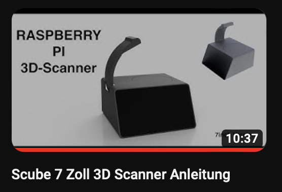
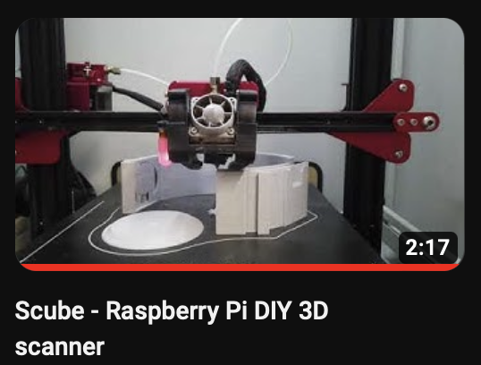
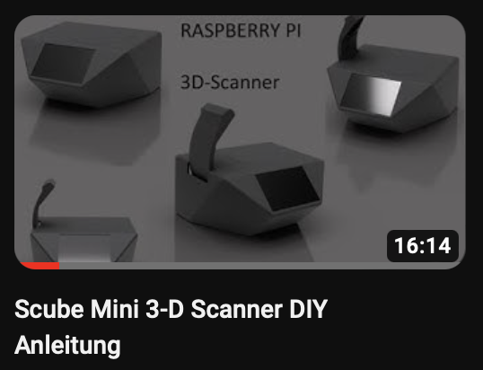

# Scube

3D-printed 3D Scanner (Work in Progress)

This repository contains all the files and instructions you need to create a 3D-printed 3D scanner using a Raspberry Pi, two small stepper motors (28BYJ or similar), a camera with LED light, and a movable camera.
## Thingiverse
https://www.thingiverse.com/thing:4646226

#############################################

